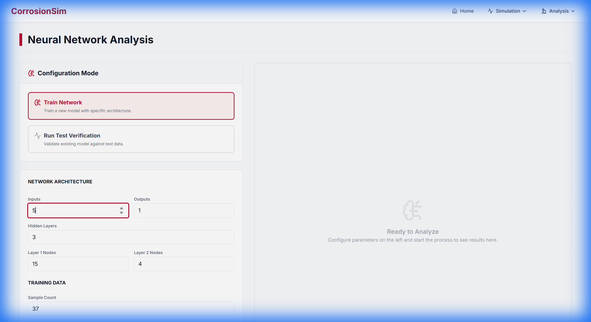

# CorrosionSim: Advanced Corrosion Analysis Platform



## Overview
CorrosionSim is a comprehensive scientific simulation and analysis platform designed for corrosion engineering. It integrates 2D cellular automata simulations with advanced neural network predictions and wavelet image analysis to model, analyze, and predict corrosion pit growth behavior.

This project uses a modern **React** frontend with **UGA (University of Georgia) branding** and a robust **Spring Boot** backend for high-performance computation.


## Key Features

### 1. Neural Network Analysis
*   **Predictive Modeling**: Uses trained neural networks (MLP) to predict corrosion outcome based on architectural parameters (inputs, outputs, hidden layers).
*   **Verification Mode**: Validates models against test datasets with real-time error analysis (MSE, MAE).
*   **Visual Results**: Displays training loss, accuracy, and detailed prediction tables in a split-view interactive dashboard.

### 2. 2D Corrosion Simulation
*   **Cellular Automata**: Simulates pit growth over time using configurable electrochemical parameters.
*   **Multi-Site Capability**: Models interactions between multiple corrosion pits.
*   **Real-time Visualization**: Dynamic grid rendering of the corrosion front.

### 3. Image Analysis
*   **Wavelet Transformation**: Processes surface imagery to detect early stages of corrosion not visible to the naked eye.
*   **Statistical Metrics**: Calculates entropy, energy, and localized intensity variances.

## Tech Stack

### Frontend
-   **React 19**: Component-based UI architecture.
-   **Tailwind CSS**: Utility-first styling with custom UGA color palette (`#BA0C2F`).
-   **Framer Motion**: Smooth, professional animations and transitions.
-   **Recharts**: Data visualization for loss/accuracy curves.
-   **Lucide React**: Modern, consistent iconography.

### Backend
-   **Java Spring Boot**: REST API handling large-scale simulation requests.
-   **Legacy Integration**: Seamlessly bridges modern web interfaces with legacy Fortran/Java simulation kernels.
-   **File Processing**: Robust handling of large datasets (`.txt`, `.csv`) for training/testing.

## Getting Started

### Prerequisites
-   Node.js (v18+)
-   Java JDK 17+
-   Maven

### Installation

1.  **Clone the Repository**
    ```bash
    git clone https://github.com/your-username/corrosion-sim.git
    cd corrosion-sim
    ```

2.  **Backend Setup**
    ```bash
    mvn spring-boot:run
    ```
    The server will start on `http://localhost:8080`.

3.  **Frontend Setup**
    ```bash
    cd frontend
    npm install
    npm start
    ```
    The application will run on `http://localhost:3000`.

## Testing
The project includes a comprehensive end-to-end test suite ensuring UI reliability and data accuracy.

```bash
cd frontend
npm test
```

## License
University of Georgia - Engineering Department. All Rights Reserved.